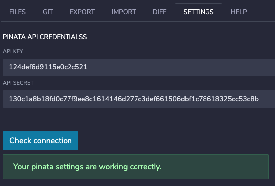

# A decentralized git plugin for Remix
______________________________________

## Requirements

- Run the IDE on HTTPS
- Do not run in icognito mode when third party cookies are blocked

## What does it do?

This plugin tracks your files in Remix as a git repository and allows you to store it as a git repository in IPFS.<br>
This repo is stored in your browser but you can export and import it from IPFS using the plugin, that way your repo is safe.<br>
Each time you export it will generate a new unique IPFS hash for you.<br>
In IPFS you will find your browser's files there commmited plus the git repository itself ( .git ).<br>
These hashes are stored in your browser's local storage or you can export them to Pinata Cloud<br>

## Pinata Cloud

To ensure that data persists on IPFS, and is not deleted during garbage collection, data can be pinned to one or more IPFS nodes.<br>
As such, you should use that control to pin any content you wish to keep on IPFS indefinitely.<br>
Pinata gives you free pinning up to 1GB of data, which should be enough to keep your projects.<br>
https://pinata.cloud/

## Git operations

You have to use the app in the same way you would when you'd manage your files in a git repo.<br>
Files are not added by git automatically, you need to add, stage and commmit them like you would do normally.<br>

## 3 ways Importing/exporting

The plugin offers you 3 ways to import/export your files:
- You just store the git repo in IPFS and keep the hash somewhere for later use
- You store the git repo in IPFS and your browser keeps a list of your hashes
- You store the git repo in IPFS and you export the hash to a list in Pinata Cloud

## Is 'Export' the same as 'push'?

No, export creates a unique version in IPFS, because IPFS can't be updated.<br>So it's not called a push
although you keep your entire GIT repo with its history.

## Is 'Import' the same as 'pull'?

No, it will pull the repo from IPFS in its entirety and erase the files in Remix. It is basically always a 'clone'.


## File collaboration

You can share files by sharing the IPFS hash that was created when you exported.<br>
But each time you export a unique version is created in IPFS, so if someone else works on the files they will also export a unique version.<br>
This app does not replace GitHub when it comes to collaboration features.

## Which custom IPFS can I use?

You can start your own IPFS daemon and set it to localhost in the config of the plugin.<br>
However you need to configure your IPFS daemon to accept calls from a web app by setting the Access-control-allow or CORS headers.<br>
Checkout the IPFS daemon documentation on how to do this.<br>

```
  "API": {
    "HTTPHeaders": {
      "Access-Control-Allow-Credentials": [
        "true"
      ],
      "Access-Control-Allow-Headers": [
        "Authorization"
      ],
      "Access-Control-Allow-Methods": [
        "GET",
        "POST"
      ],
      "Access-Control-Allow-Origin": [
        "*"
      ],
      "Access-Control-Expose-Headers": [
        "Location"
      ]
    }
  }
```

## Cloning on desktop

It is a git repo. If you wish to clone it on your desktop with 'IPFS get'. Use the IPFS to do this.

## Why not use Github?

This is not a GitHub app but a decentralized way of doing bits of what GitHub does. It's not a replacement.
## How can I get my files from Github?

You can clone the files on your desktop, put them in IPFS and use the IPFS hash to import them into the plugin.<br>
Be careful: the browser does not have unlimited storage, large repositories will not work!

## How can I get my files into Github?

You can get the files from IPFS and just add an origin and push.<br>

# Basic Operations

## Set up Pinata

Go to [pinata.cloud ](https://pinata.cloud/) and sign up. After that in the section API KEYS you can add a new key.<br>

